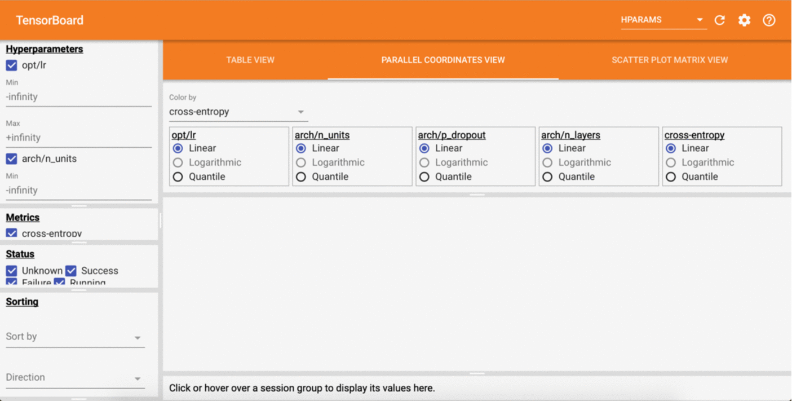

Quick start
===========

A worked example
~~~~~~~~~~~~~~~~

Let's delve in into the API of Hypertunity by going through a worked example---neural network hyperparameter optimisation.
In the following we will tune the number of layers and units, the non-linearity type, as well as the dropout rate and the
learning rate of the optimiser.

**Disclaimer:** This example serves a demonstration purpose only. It does not represent an advanced way of performing
neural network architecture search!

First thing we do it to import Hypertunity, tensorflow and numpy and define a helper data loading function:

.. code-block:: python

    import hypertunity as ht
    import numpy as np
    import tensorflow as tf

    import hypertunity.reports.tensorboard as ht_tb

    def load_mnist():
        (train_x, train_y), (test_x, test_y) = tf.keras.datasets.mnist.load_data()
        data_shape = train_x.shape[1:]
        train_x = train_x.reshape(-1, np.prod(data_shape)).astype(np.float32) / 255.
        mean_train = np.mean(train_x, axis=0)
        train_x -= mean_train
        test_x = test_x.reshape(-1, np.prod(data_shape)).astype(np.float32) / 255.
        test_x -= mean_train
        train_y = tf.keras.utils.to_categorical(train_y, num_classes=10)
        test_y = tf.keras.utils.to_categorical(test_y, num_classes=10)
        return (train_x, train_y), (test_x, test_y)

Next we define a function that will build the model given the architectural hyperparameters and the learning rate,
followed by the objective which will wrap the model building and evaluation:

.. code-block:: python

    def build_model(inp_size, out_size, n_layers, n_units, p_dropout, activation):
        inp = tf.keras.Input(inp_size)
        h = inp
        for l in range(n_layers - 1):
            h = tf.keras.layers.Dense(n_units, activation=activation)(h)
            h = tf.keras.layers.Dropout(rate=p_dropout)(h)
        h = tf.keras.layers.Dense(out_size, activation=None)(h)
        out = tf.keras.layers.Softmax()(h)
        model = tf.keras.models.Model(inputs=inp, outputs=out)
        return model

    def objective_fn(**config) -> float:
        (train_x, train_y), (test_x, test_y) = load_mnist()
        model = build_model(train_x.shape[-1], train_y.shape[-1],
                            config["arch"]["n_layers"],
                            config["arch"]["n_units"],
                            config["arch"]["p_dropout"],
                            config["arch"]["activation"])
        opt = tf.keras.optimizers.Adam(learning_rate=config["opt"]["lr"])
        model.compile(optimizer=opt, loss="categorical_crossentropy")
        model.fit(train_x, train_y, batch_size=100, epochs=1)
        score = model.evaluate(test_x, test_y, batch_size=test_x.shape[0])
        return score

Now that we can build a model, we should define the ranges of possible values for the these parameters.
This can be done with creating a :class:`Domain` instance as follows:

.. code-block:: python

    domain = ht.Domain({
        "arch": {
            "n_layers": {1, 3, 5},
            "n_units": {10, 50, 100, 500},
            "p_dropout": [0, 0.9999],
            "activation": {"relu", "selu", "elu"}
        },
        "opt": {
            "lr": [1e-9, 1e-2]
        }
    })

The :class:`Domain` plays a central role in Hypertunity and we will make a frequent use of it later as well.
An important related class is the :class:`Sample`. It can be thought of as one realisation of the variables from the domain,
which in our case is one particular configuration of network hyperparameters.

Using the domain, we can set up the optimiser and the result visualiser also used for experiment logging.
In this case we use :class:`BayesianOptimisation` and :class:`Tensorboard` respectively:

.. code-block:: python

    optimiser = ht.BayesianOptimisation(domain)
    tb_rep = ht_tb.Tensorboard(domain,
                               metrics=["cross-entropy"],
                               logdir="./mnist_mlp",
                               database_path="./mnist_mlp")

After we create the :class:`Tensorboard` reporter we will be prompted to run `tensorboard --logdir=./mnist_mlp`
in the console and open Tensorboard in the browser. We can do this also before we launch the actual optimisation.

One last bit before running it is the definition of the job schedule as well as optimiser and reporter update loop.
This is to ensure that samples are generated, experiments are run and the results used to improve the underlying model of the :class:`BayesianOptimisation` optimiser.
To schedule one experiment at a time, for 50 consecutive steps we create a :class:`Job` for each function call of ``objective_fn``
with a set of suggested hyperparameters:

.. code-block:: python

    n_steps = 50
    batch_size = 1
    with ht.Scheduler(n_parallel=batch_size) as scheduler:
        for i in range(n_steps):
            samples = optimiser.run_step(batch_size=batch_size, minimise=True)
            jobs = [ht.Job(task=objective_fn, args=s.as_dict() for s in samples]
            scheduler.dispatch(jobs)
            evaluations = [r.data for r in scheduler.collect(n_results=batch_size, timeout=100.0)]
            optimiser.update(samples, evaluations)
            for sample_evaluation_pair in zip(samples, evaluations):
                tb_rep.log(sample_evaluation_pair)

If we have a look at the Tensorboard dashboard while this is running, we should be able to see results being updated live!

Even quicker start
~~~~~~~~~~~~~~~~~~

A high-level wrapper class :class:`Trial` allows for seamless parallel optimisation without having to schedule jobs,
update the optimiser or log results explicitly. The API is reduced to the minimum and yet remains flexible as
one can specify any optimiser or reporter:

.. code-block:: python

    trial = ht.Trial(objective=objective_fn,
                     domain=domain,
                     optimiser="bo",
                     reporter="tensorboard",
                     logdir="./mnist_mlp",
                     database_path="./mnist_mlp",
                     metrics=["cross-entropy"])

    trial.run(n_steps, batch_size=batch_size, n_parallel=batch_size)
